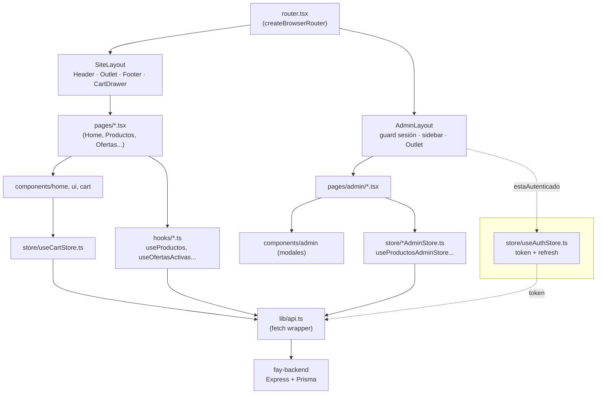

# FAY Frontend — Estructura y arquitectura

Documento de referencia del frontend de FAY: herramientas usadas, qué hace cada carpeta/archivo, y cómo se conectan entre sí. Generado a partir del código el 2026-07-24 — si la estructura cambia, este documento debe actualizarse a mano.

---

## 1. Stack (herramientas)

| Herramienta | Para qué se usa |
|---|---|
| **React 19** | Librería de UI. |
| **TypeScript** | Tipado estático en todo el código (`.ts`/`.tsx`). |
| **Vite** | Dev server + bundler. Config en `vite.config.ts`. |
| **Tailwind CSS v4** (`@tailwindcss/vite`) | Estilos utility-first. Tokens de marca definidos en `src/index.css`. |
| **react-router-dom v7** | Ruteo SPA (`createBrowserRouter`), definido en `src/router.tsx`. |
| **Zustand** | Estado global (carrito, auth, toasts, confirmaciones, datos admin). Carpeta `src/store/`. |
| **Framer Motion** | Animaciones (transiciones de página, carruseles, modales). |
| **lucide-react** | Set de íconos. |
| **react-helmet-async** | Provider montado en `main.tsx` para manejar `<head>` por página — *hoy ninguna página usa `<Helmet>` todavía, queda como capacidad disponible sin explotar*. |
| **clsx + tailwind-merge** (via `lib/utils.ts → cn()`) | Combinar clases de Tailwind condicionalmente sin colisiones. |
| **ESLint** (`typescript-eslint`, `eslint-plugin-react-hooks`, `eslint-plugin-react-refresh`) | Lint. Config en `eslint.config.js`. |
| **pnpm** | Gestor de paquetes (parte de un workspace con `fay-backend`). |

Alias de importación: **`@/*` → `src/*`** (configurado en `tsconfig.app.json` y `vite.config.ts`).

Backend consumido: API REST en Express, apuntada por `VITE_API_URL` (`.env`) — ver `src/lib/api.ts`.

---

## 2. Árbol de carpetas

```
fay-frontend/
├── index.html                  # entry HTML, monta <div id="root">
├── vite.config.ts              # plugins (react, tailwindcss) + alias @
├── eslint.config.js
├── tsconfig.json                # raíz: referencias a app/node + alias @
├── tsconfig.app.json             # config TS del código de la app (src/)
├── tsconfig.node.json            # config TS de archivos de tooling (vite.config.ts)
├── package.json
├── .env                          # VITE_API_URL
├── public/
│   ├── favicon.svg
│   └── icons.svg
└── src/
    ├── main.tsx                 # entry de React: StrictMode > HelmetProvider > RouterProvider
    ├── router.tsx                # todas las rutas (público + admin)
    ├── index.css                  # tokens --fay-* + Tailwind + estilos base
    ├── App.tsx / App.css          # ⚠ scaffold default de Vite, sin uso (nadie lo importa)
    │
    ├── layouts/
    │   ├── SiteLayout.tsx         # envoltorio público: Header + <Outlet/> + Footer + CartDrawer
    │   └── AdminLayout.tsx        # envoltorio admin: sidebar + guard de sesión + <Outlet/> + Toast/Confirm
    │
    ├── pages/                     # una página = una ruta pública
    │   ├── Home.tsx
    │   ├── Productos.tsx
    │   ├── ProductoDetalle.tsx
    │   ├── Ofertas.tsx
    │   ├── Nosotros.tsx
    │   ├── Contactanos.tsx
    │   ├── NotFound.tsx
    │   └── admin/                 # páginas del panel /fay-admin-access
    │       ├── AdminLogin.tsx
    │       ├── AdminDashboard.tsx
    │       ├── AdminProductos.tsx
    │       ├── AdminCategorias.tsx
    │       ├── AdminOfertas.tsx
    │       └── AdminPopulares.tsx
    │
    ├── components/
    │   ├── layout/                # usados por SiteLayout
    │   │   ├── Header.tsx
    │   │   └── Footer.tsx
    │   ├── home/                  # usados solo por pages/Home.tsx
    │   │   ├── Hero.tsx
    │   │   ├── OfertasBanner.tsx
    │   │   └── ProductosDestacados.tsx
    │   ├── cart/
    │   │   └── CartDrawer.tsx     # usado por SiteLayout
    │   ├── ui/                    # piezas reutilizables genéricas
    │   │   ├── Breadcrumbs.tsx
    │   │   ├── ProductCard.tsx
    │   │   ├── ProductCardSkeleton.tsx
    │   │   ├── OfertaCard.tsx
    │   │   ├── ConfirmDialog.tsx  # usado por AdminLayout
    │   │   └── ToastContainer.tsx # usado por AdminLayout
    │   └── admin/                 # modales de formulario, uno por entidad
    │       ├── ProductoFormModal.tsx
    │       ├── OfertaFormModal.tsx
    │       └── CategoriaFormModal.tsx
    │
    ├── hooks/                     # fetch de datos públicos (sin auth)
    │   ├── useProductos.ts
    │   ├── useProducto.ts
    │   ├── useCategorias.ts
    │   └── useOfertasActivas.ts
    │
    ├── store/                     # estado global (Zustand)
    │   ├── useCartStore.ts        # carrito — público, persistido en localStorage["fay-cart"]
    │   ├── useAuthStore.ts        # sesión admin + refresh token, persistido en localStorage["fay-auth"]
    │   ├── useToastStore.ts       # notificaciones — solo admin
    │   ├── useConfirmStore.ts     # diálogo de confirmación — solo admin
    │   ├── useProductosAdminStore.ts  # CRUD productos (autenticado)
    │   └── useOfertasAdminStore.ts    # CRUD ofertas (autenticado)
    │
    ├── lib/
    │   ├── api.ts                 # wrapper fetch central — TODAS las llamadas HTTP pasan por acá
    │   ├── utils.ts                # cn(), formatearPrecio(), ofertaEstaActiva()
    │   ├── whatsapp.ts             # arma mensajes y abre wa.me (checkout y contacto)
    │   ├── uploads.ts              # sube imágenes a Cloudinary vía POST /uploads
    │   ├── useMotionSeguro.ts      # hook: prefers-reduced-motion
    │   └── useCargaSimulada.ts     # ⚠ sin uso — era un mock previo a tener backend real
    │
    ├── types/
    │   └── index.ts               # contratos TS: Producto, CategoriaProducto, Oferta, ItemCarrito, Usuario
    │
    └── assets/
        ├── logo-fay.png
        ├── hero.png
        └── react.svg, vite.svg    # ⚠ sobrantes del scaffold, solo los usa App.tsx (sin uso)
```

---

## 3. Cómo se relacionan las capas

Flujo de una pantalla típica, de arriba hacia abajo:



**Reglas del flujo:**

- **`router.tsx`** es el único lugar donde se decide qué componente responde a qué URL. Todo lo demás cuelga de ahí.
- **Layouts** (`SiteLayout`, `AdminLayout`) son el "marco" que envuelve cualquier página de su árbol — se montan una sola vez y las páginas cambian dentro de su `<Outlet/>`.
- **Pages** orquestan: piden datos (hooks o stores) y arman la UI con **components**. Una page casi nunca llama a `lib/api.ts` directamente — pasa por un hook o un store.
- **Hooks** (`hooks/`) son de solo lectura y públicos (sin token) — devuelven `{ datos, cargando, error }`.
- **Stores admin** (`useProductosAdminStore`, `useOfertasAdminStore`) hacen lo mismo que los hooks pero con operaciones de escritura (crear/actualizar/eliminar) que requieren `token` de `useAuthStore`.
- **`lib/api.ts`** es el único punto que sabe hablar HTTP con el backend: agrega `Authorization` si hay token, y si una llamada autenticada responde 401, intenta refrescar el token una vez antes de fallar.
- **`useCartStore`** es el único store que tocan las páginas públicas — persiste en `localStorage` y no depende de sesión.
- Los **modales de admin** (`components/admin/*FormModal.tsx`) no llaman a la API ellos mismos: reciben `onGuardar` de la page que los abrió y le devuelven el formulario ya armado.

---

## 4. Convenciones observadas

- **Idioma:** nombres de funciones, variables, componentes y textos de UI están en español (`obtenerProductos`, `cargando`, `manejarSubmit`); solo los términos técnicos de React/librerías quedan en inglés.
- **Persistencia:** solo `useCartStore` y `useAuthStore` usan `zustand/persist` (localStorage). El resto del estado vive solo en memoria y se pierde al recargar.
- **Fetching:** no hay librería de data-fetching (React Query, SWR); cada hook maneja su propio `useState` + `useEffect` + `api.get`.
- **Sin tests:** no existe carpeta de tests ni configuración de test runner en este proyecto.

## 5. Deuda conocida (referenciada, no resuelta en este documento)

- `App.tsx`, `App.css`, `assets/react.svg`, `assets/vite.svg` — scaffold de Vite sin uso real, candidatos a borrar.
- `lib/useCargaSimulada.ts` — hook mock que quedó huérfano tras conectar el backend real.
- `HelmetProvider` está montado pero ningún page usa `<Helmet>` — no hay `<title>`/meta por página todavía.
